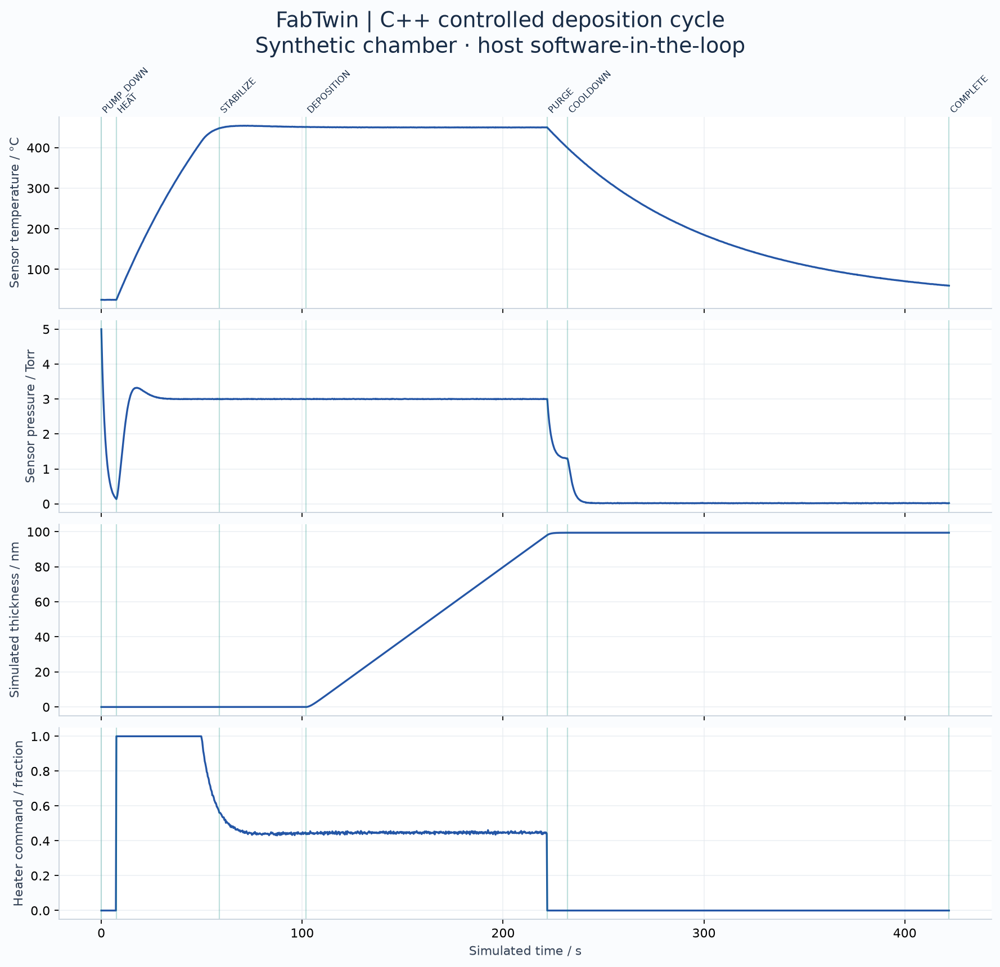
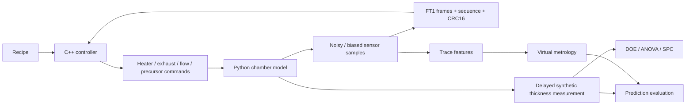

# FabTwin

[](https://github.com/mojaffri/FabTwin/actions/workflows/ci.yml)
[](LICENSE)

**A virtual thin-film deposition tool, controlled by C++, analyzed like a manufacturing process.**

Python · C++17 · Process control · DOE / ANOVA · SPC · Virtual metrology

FabTwin connects a dynamic, CVD-like chamber model to compiled equipment-control logic. Every experimental wafer runs through the recipe state machine and PID loops. The resulting sensor traces feed statistical process characterization and virtual metrology.

**Status: software-in-the-loop first release.** All chamber signals and film measurements are synthetic. The C++ controller runs on the host computer. No STM32, Arduino, vacuum equipment, deposition hardware, or physical film measurements have been tested. No hardware purchases are needed.



Reference run: **37 passing Python tests + native C++ tests · 620 simulated cycles · 0.68 nm held-out VM MAE**. The drift challenge raises VM MAE to **4.20 nm**. DOE confirmation wafers average **100.34 ± 0.75 nm** (sample SD, n=12). These are reproducible synthetic results; see the report for the nominal-kinetics benchmark, uncertainty, and retained SPC signals.

## Start here

1. Read the [reference experiment report](reports/reference/REPORT.md) and inspect its plots and raw data.
2. Reproduce the cycle and run the tests.
3. Change one assumption, rerun the experiments, and explain the result in an interview.

For a concise explanation of the decisions and limitations, read the [engineering case study](docs/CASE_STUDY.md). In this simulation, the nominal-kinetics baseline slightly outperforms ML; the project reports that comparison openly.

Python 3.10+ and a C++17 compiler are required. Python 3.12 is the reference environment. From this repository folder:

```bash
python -m venv .venv
# Windows PowerShell: .venv\Scripts\Activate.ps1
# macOS / Linux: source .venv/bin/activate
python -m pip install -r requirements.txt
python scripts/build_controller.py
python -m pytest -q
python -m fabtwin.cli demo --out runs/demo
python -m fabtwin.cli all --out runs/full --seed 7
python scripts/verify_report.py runs/full
```

If no compiler is installed, a workspace-local route is:

```bash
python -m pip install ziglang
python scripts/build_controller.py
# Installed ziglang is discovered automatically; --zig PATH overrides it.
```

Alternatively, Visual Studio Build Tools + CMake on Windows, or GCC/Clang + CMake elsewhere:

```bash
cmake -S controller -B build
cmake --build build --config Release
ctest --test-dir build -C Release --output-on-failure
```

The Python interface loads the compiled library from `build/`. A missing build raises an explicit error; there is no Python controller substituted behind the scenes. For a nonstandard library location, set `FABTWIN_CONTROLLER` to its absolute path. Use an editable install from the repository: the controller sources and reports are repository assets, not wheel resources.

For the exact reference Python dependency versions, install `requirements-reference.txt` instead of `requirements.txt` on Python 3.12. The normal requirements allow compatible newer versions; floating-point results and fitted models can vary across library/compiler versions. The reference host used Zig 0.16.0 as its C++ compiler. See [validation evidence](docs/VALIDATION.md).

## Demonstrations

### Measurement-system extension

The [crossed Gage R&R study](docs/MEASUREMENT.md) adds 10 synthetic parts × 3 operators × 3 repeats to examine measurement noise before interpreting process capability. Run `python -m fabtwin.measurement --out runs/measurement`. The nominal and noisy gages consume **11.58% and 57.77%** of the illustrative thickness tolerance respectively; these are synthetic sensitivity results, not hardware qualification. The current local suite has **40 Python tests**, including three checks for this extension; the original 37-test release evidence below is preserved.

### Complementary portfolio scope

FabTwin remains the **deposition process/manufacturing** project: dynamic control, DOE, film-thickness response, measurement systems and virtual metrology. The separate **FabGuard** project covers plasma-etch **equipment analytics across a tool fleet**: subgroup SPC, matching, maintenance forecasts, reliability/OEE and recipe tradeoffs. Keep those equipment-fleet features in FabGuard rather than adding a second overlapping analytics suite here.

| Command | Engineering question | Deliverables |
|---|---|---|
| `demo` | Can the controller complete an interlocked deposition recipe? | Sensor and actuator traces, state transitions, cycle plot |
| `doe` | Which settings influence film thickness, including interactions and curvature? | Randomized 40-run design, Type II ANOVA, quadratic response surface, lack-of-fit test, 12 confirmation wafers |
| `spc` | When does a fixed recipe leave its baseline behavior? | 260 wafers, I-MR and EWMA charts, Phase I diagnostics, Cp/Cpk and Pp/Ppk |
| `vm` | Can process traces predict thickness on unseen wafers? | 300 wafers, nominal-kinetics baseline, independent calibration/test sets, uncertainty, residual monitoring, saved predictor |
| `faults` | What faults trip the controller, and what remains invisible? | Seven injected scenarios and a fault matrix |
| `all` | Does the full workflow work together? | All above; SPC uses the DOE-selected recipe |

Each command accepts `--out` and `--seed` (fault demonstration scenarios intentionally use fixed seed 7). `all` simulates 620 complete or aborted cycles including the independent confirmations and seven faults. Runtime depends on the machine. The reference folder contains generated evidence, not hand-entered performance claims. New runs go under ignored `runs/` by default.

## Architecture



The serial link is emulated by passing framed ASCII bytes through a C ABI in memory. Both directions use CRC16. This tests packet parsing and controller integration, but does not measure UART timing, USB reliability, real-time scheduling, or electrical behavior.

The recipe is `IDLE → PUMP_DOWN → HEAT → STABILIZE → DEPOSITION → PURGE → COOLDOWN → COMPLETE`. Interlock violations transition to a latched `FAULT`. The synthetic initial chamber pressure is already 5 Torr; atmospheric loading and venting are outside this model.

## Why this belongs in a ChemE semiconductor portfolio

- **Process engineering:** connect thermal and vacuum dynamics, saturating kinetics, recipe variables, and wafer thickness; use a designed experiment instead of one-factor-at-a-time tuning.
- **Manufacturing:** distinguish specification limits from control limits, baseline capability from drift, statistical significance from physical validity, and confirmation runs from training fit.
- **Equipment engineering:** execute a portable C++ state machine, bounded actuators, PID with anti-windup, sustained stability qualification, state timeouts, and latched fault handling.
- **Data and metrology:** prevent simulator-truth leakage, use chronological wafer splits, compare to a baseline, and demonstrate a failure mode under unmeasured drift.

These are relevant project topics for process/equipment applications to Lam Research, Applied Materials, Micron, Intel, and TI. This project is independent and does not reproduce or claim validation against any company's tools, recipes, or hiring criteria.

## Repository guide

```text
controller/          Portable control core + host protocol bridge + CMake
src/fabtwin/         Chamber, protocol, simulation, statistics, experiments, CLI, plots
tests/               Integration, interlock, protocol, statistics, and validation tests
examples/            Small runnable examples
scripts/             Cross-platform controller build helper
docs/                Model equations, protocol, interpretation, STM32 path, resume guidance
reports/reference/   Reproducible first-release results, CSVs, figures and source manifest
.github/workflows/   Windows/Linux/macOS native and Python checks + demo artifacts
```

Read [model assumptions](docs/MODEL.md), [protocol and interlocks](docs/PROTOCOL.md), [experiment interpretation](docs/EXPERIMENTS.md), [STM32 extension plan](docs/STM32.md), and [resume / interview notes](docs/PORTFOLIO.md).

## Boundaries

The chamber is a lumped educational surrogate with chosen coefficients. It is not a calibrated digital twin, predictive chemistry model, ALD simulator, plasma simulation, or safety-certified controller. It omits spatial nonuniformity, actual precursor chemistry, nucleation, stress, conformality, particle defects, and metrology-system validation. Its simulated thickness tolerance is 100 ± 5 nm, an illustrative specification.

The point is an inspectable workflow and engineering reasoning. Lower synthetic MAE or higher Cpk does not establish performance on real wafers. Plausible sensor bias and unmeasured surface drift can escape simple equipment interlocks; the reference experiments expose that limitation.

## References

Statistical choices follow the [NIST/SEMATECH engineering statistics handbook](https://www.itl.nist.gov/div898/handbook/), specifically [central composite designs](https://www.itl.nist.gov/div898/handbook/pri/section3/pri3361.htm), [EWMA](https://www.itl.nist.gov/div898/handbook/pmc/section3/pmc324.htm), and [capability](https://www.itl.nist.gov/div898/handbook/pmc/section1/pmc16.htm). [Lam Research's CVD overview](https://www.lamresearch.com/technology/chemical-vapor-deposition-cvd/) provides industry context; it is not the source of the simulator coefficients.

MIT licensed. See [LICENSE](LICENSE).
