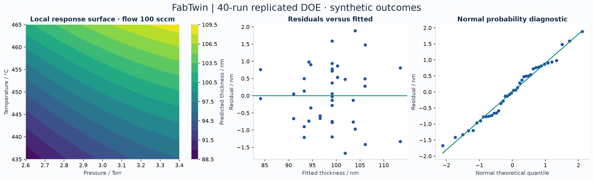
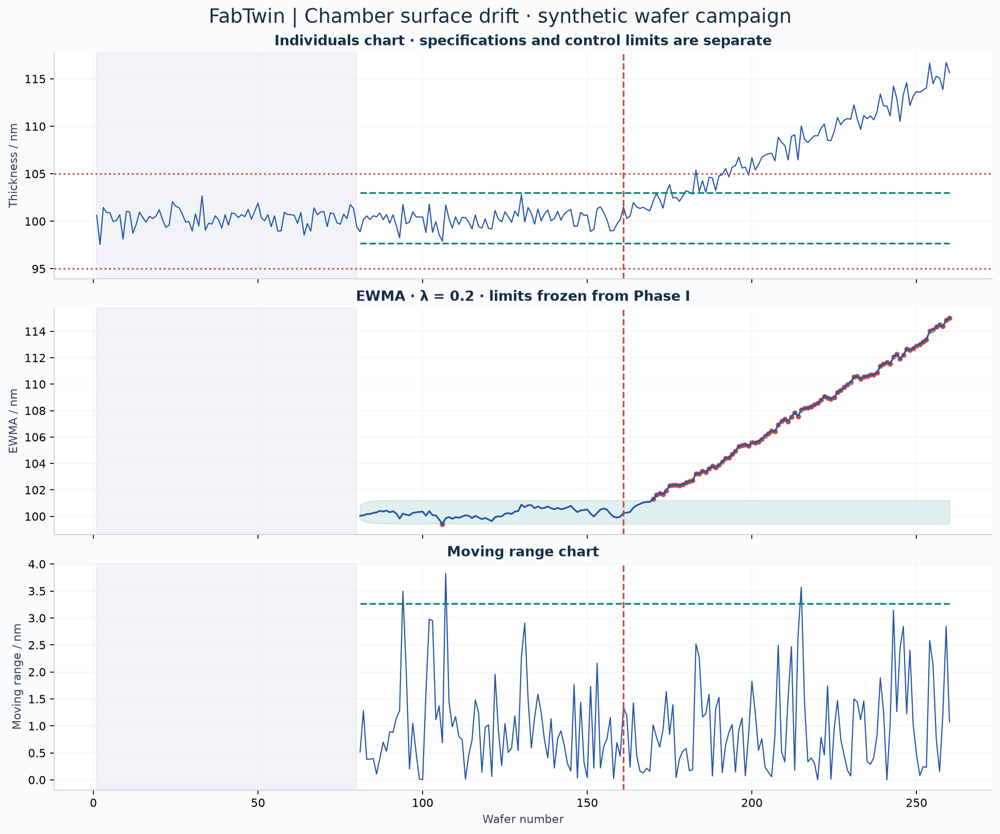
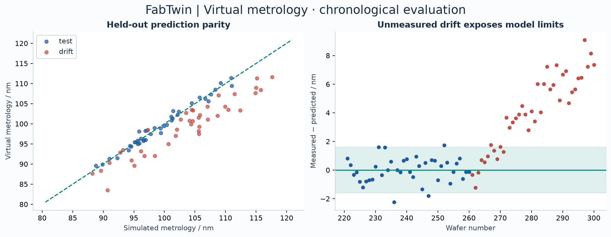

# FabTwin experiment report

All results are synthetic. Controller executes on the host computer; no physical hardware testing.

DOE: 40 runs + 12 independent confirmation wafers. Confirmation thickness: 100.34 ± 0.75 nm (sample SD).

SPC: baseline Cp 1.88, Cpk 1.76; descriptive estimates, subject to Phase I diagnostics. EWMA first post-drift signal: wafer 170; delay 9 wafers. Pre-drift signals: 1/80 monitored wafers.

Phase I contains 1 individual-chart and 2 moving-range signals. These are retained. The baseline has not been qualified as statistically in control; capability values are descriptive estimates, not process acceptance evidence.

VM: selected quadratic_ridge_1.0; held-out MAE 0.68 nm, drift MAE 4.20 nm. Held-out interval coverage 92%; drift coverage 22%.

| Held-out benchmark | MAE / nm |
|---|---:|
| Training-mean predictor | 4.67 |
| Nominal kinetics from measured traces | 0.63 |
| Selected virtual-metrology model | 0.68 |

VM MAE bootstrap 95% interval: 0.53–0.86 nm, assuming independent test wafers. The kinetics baseline deliberately shares the simulator's nominal structure and coefficients; it has no access to true wafer gain. It is a strong synthetic benchmark, not independently validated chemistry.

Delayed-metrology residual EWMA first signals at wafer 272 after drift starts at wafer 261 (delay 11 wafers). Pre-drift flags: 0/40. Limits are frozen from calibration residuals; this detector requires measured thickness and cannot independently discover drift before metrology arrives.

Full metrics, raw wafer records, design tables, diagnostics and source hashes accompany this report.
